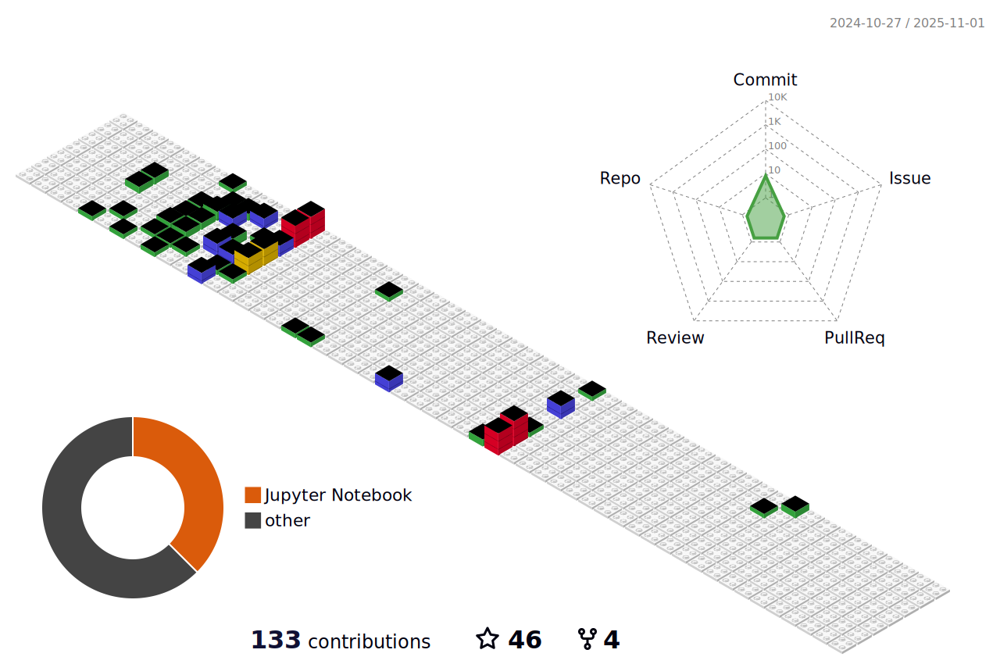

## Hi there 👋 

<!-- -  -->

- 🔭 I’m currently pursuing my master's degree in **Computer Science and Artificial Intelligence** at **Southeast University (SEU)**.
- 🌱 I’m currently foucs on **Urban Computing and Graph Data Mining**.
- 🎓 I completed my undergraduate studies in **Computer Science** at **NanJing University of Science and Technology (NJUST)**.
- 📫 How to reach me: [Email](dongkan@seu.edu.cn) | [Google Scholar](https://scholar.google.com/citations?user=QlMlt9EAAAAJ&hl=en).

## Contributions

## Stats

 &nbsp;&nbsp; 
